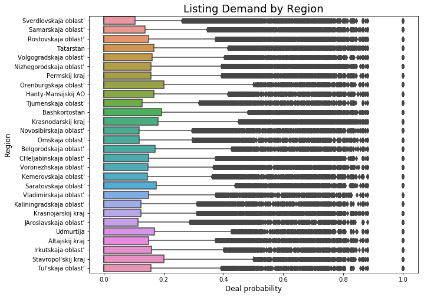
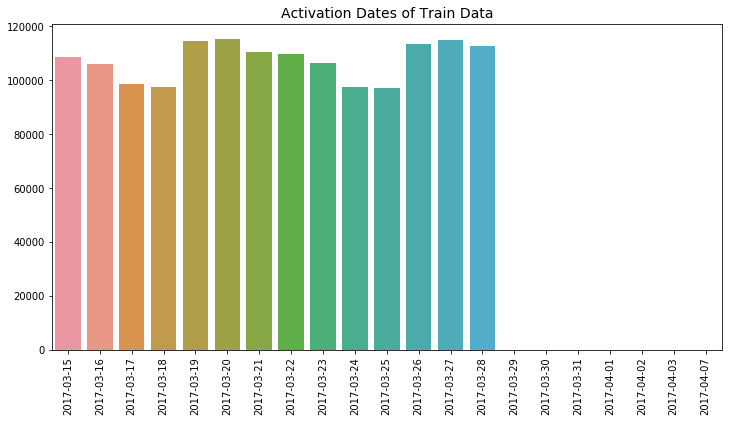
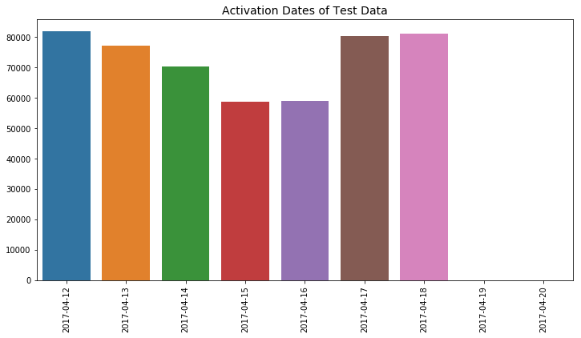

# Outline

[1. Loading Data](#1.-Loading-Data)

[2. Exploratory Data Analysis](#2.-Exploratory-Data-Analysis)

- [2.1. Distribution of Target](#2.1.-Distribution-of-Target)
- [2.2. Distribution of Demand by Region](#2.2.-Distribution-of-Demand-by-Region)
- [2.3. Deal Probability by City](#2.3.-Deal-Probability-by-City)
- [2.4. Deal Probability by Parent Category](#2.4.-Deal-Probability-by-Parent-Category)
- [2.5. Activation Date and Deal Probability](#2.5.-Activation-Date-and-Deal-Probability)
- [2.6. Duplicates in Train and Test](#2.6.-Duplicates-in-Train-and-Test)

[3. Pipeline](#3.-Pipeline)

- [3.1. Cross-Decomposition of TF-IDF Vectors with BiGrams](#3.1.-Cross-Decomposition-of-TF-IDF-Vectors-with-BiGrams)
- [3.2. Discretized Vector Cross-Decomposition](#3.2.-Discretized-Vector-Cross-Decomposition)
- [3.3. Discretized Vector Sums](#3.3.-Discretized-Vector-Sums)
- [3.4. Sentiment Analysis](#3.4.-Sentiment-Analysis)
- [3.5. Categorical Features](#3.5.-Categorical-Features)
- [3.6. Other Features](#3.6.-Other-Features)
- [3.7. Scaling Features](#3.7.-Scaling-Features)

[4. Evaluation](#4.-Evaluation)

- [4.0. Baseline Linear Regression](#4.0.-Baseline-Linear-Regression)
- [4.1. PLSR 50 Components](#4.1.-PLSR-50-Components)
- [4.2. Light Gradient Boosting](#4.2.-Light-Gradient-Boosting)
- [4.3. LGB with PLSR 50 Components](#4.3.-LGB-with-PLSR-50-Components)
- [4.4. Feature Selection](#4.4.-Feature-Selection)
- [4.5. LGB with 30 Ridge Features](#4.5.-LGB-with-30-Ridge-Features)
- [4.6. Optimal N Features](#4.6.-Optimal-N-Features)
- [4.7. PLSR by Original Feature](#4.7.-PLSR-by-Original-Feature)
- [4.8. LGB with PLSR by Original Feature](#4.8.-LGB-with-PLSR-by-Original-Feature)
- [4.9. Multi Layer Perceptron](#4.9.-Multi-Layer-Perceptron)
- [4.10. Keras](#4.10.-Keras)
- [4.11. RandomForestRegressor](#4.11.-RandomForestRegressor)

[5. Product](#5.-Product)

# 1. Loading Data


```python
import pandas as pd
import matplotlib.pyplot as plt
import seaborn as sns
import numpy as np
import cyrtranslit
from sklearn import preprocessing, model_selection, metrics, feature_selection, ensemble, linear_model, cross_decomposition, feature_extraction, decomposition, compose,neural_network
import lightgbm as lgb
from scipy import stats
import time
from sklearn.externals import joblib
import pickle
import os

import tensorflow as tf
import keras
from keras.models import Sequential
from keras.layers import Dense, Dropout, Flatten, Conv2D, MaxPooling2D
from keras.layers import LSTM, Input, TimeDistributed
from keras.models import Model
from keras.optimizers import RMSprop

# Import the backend
from keras import backend as K

color = sns.color_palette()
%matplotlib inline
```

    Using TensorFlow backend.


```python
train = pd.read_csv('../train.csv.zip',compression='zip',parse_dates=['activation_date'])
test = pd.read_csv('../test.csv.zip',compression='zip',parse_dates=['activation_date'])
```

# 2. Exploratory Data Analysis

[Back to Outline](#Outline)

**Summary**

- Data is big.

- It's in Russian with Cyrillic alphabet.

- Outcome variable is very non-normal. There's three distinct groups. (Zero Range, Lower Range, Upper Range)

- Titles and descriptions offer endless NLP opportunities.

- Plenty of categorical data to binarize.

    

## 2.1. Distribution of Target

[Back to Outline](#Outline)

>There's about a million listings with zero demand, and a much smaller number with varying chance of selling.


```python
# Define deal probabilities and those over zero
probs = train["deal_probability"].values
probs_no0 = probs[probs>0]

# Plot probability histogram
plt.figure(figsize=(12,4))
sns.distplot(probs, kde=False)
plt.title("Deal Probability of All Listings", fontsize=16)
plt.show()

# Probabilities > 0 hist
plt.figure(figsize=(12,4))
sns.distplot(probs_no0, kde=False)
plt.xlabel('Deal Probility', fontsize=12)
plt.title("Deal Probability of Listings (> 0)", fontsize=16)
plt.show()

# Scatter of sorted probs
plt.figure(figsize=(12,4))
plt.scatter(range(probs_no0.shape[0]), np.sort(probs_no0))
plt.title("Listings (> 0) Sorted by Deal_Probability", fontsize=16)
plt.show()
```


## 2.2. Distribution of Demand by Region

[Back to Outline](#Outline)

First let's translate the regions from Russian using the `cyrtranslit` package. Then visualize the distribution of each region.


```python
# Get unique regions in cyrilic
cyrilic_regs = train.region.unique().tolist()
# Get unique translations
latin_regs = [cyrtranslit.to_latin(reg,'ru') for reg in cyrilic_regs]

# Put regions in a dictionary
reg_dict = {}
for cyr, lat in zip(cyrilic_regs,latin_regs):
    reg_dict[cyr]=lat
    
# Create a translated list of each region in the dataset
en_list = []
for reg in train.region:
    en_list.append(reg_dict[reg])

# Add english list as column
train['region_en'] = en_list

print('Translation of Russian Regions')
pd.DataFrame(latin_regs[:10],index=cyrilic_regs[:10],columns=['Translations'])
```

    Translation of Russian Regions


<table border="1" class="dataframe">
  <thead>
    <tr style="text-align: right;">
      <th></th>
      <th>Translations</th>
    </tr>
  </thead>
  <tbody>
    <tr>
      <th>Свердловская область</th>
      <td>Sverdlovskaja oblast'</td>
    </tr>
    <tr>
      <th>Самарская область</th>
      <td>Samarskaja oblast'</td>
    </tr>
    <tr>
      <th>Ростовская область</th>
      <td>Rostovskaja oblast'</td>
    </tr>
    <tr>
      <th>Татарстан</th>
      <td>Tatarstan</td>
    </tr>
    <tr>
      <th>Волгоградская область</th>
      <td>Volgogradskaja oblast'</td>
    </tr>
    <tr>
      <th>Нижегородская область</th>
      <td>Nizhegorodskaja oblast'</td>
    </tr>
    <tr>
      <th>Пермский край</th>
      <td>Permskij kraj</td>
    </tr>
    <tr>
      <th>Оренбургская область</th>
      <td>Orenburgskaja oblast'</td>
    </tr>
    <tr>
      <th>Ханты-Мансийский АО</th>
      <td>Hanty-Mansijskij AO</td>
    </tr>
    <tr>
      <th>Тюменская область</th>
      <td>Tjumenskaja oblast'</td>
    </tr>
  </tbody>
</table>
</div>


- There is a tremendous amount of outliers. Not surprising due to the large size of the data.
- Anything with over 50% chances of selling is an outlier. Based on regional data, expecting a sale is an exception rather than the norm.


```python
# Boxplots by Region
plt.figure(figsize=(10,8))
sns.boxplot(x="deal_probability", y="region_en", data=train)
plt.xlabel('Deal probability', fontsize=12)
plt.ylabel('Region', fontsize=12)
plt.title("Listing Demand by Region",fontsize=18)
plt.show()
```





### Percentage of Listings per Region


```python
# Get region group counts, sort and divide by N of listings
region_perc = train.groupby('region_en').count().item_id.sort_values(ascending=False)/len(train)

# Top 5 regions
print('Percentage of Listings in Top Regions\n')
print(np.round(region_perc*100,2)[:5])
```

    Percentage of Listings in Top Regions
    
    region_en
    Krasnodarskij kraj        9.41
    Sverdlovskaja oblast'     6.28
    Rostovskaja oblast'       5.99
    Tatarstan                 5.41
    CHeljabinskaja oblast'    5.21
    Name: item_id, dtype: float64


### Count of Listings by Region


```python
# Visualize sorted listing counts by region
plt.figure(figsize=(10,8))
sns.countplot(data=train,y='region_en',order=region_perc.keys())
plt.title('Count of Listings by Region',fontsize=18)
plt.ylabel('Region EN')
plt.xlabel('Number of Listings')
plt.show()
```


## 2.3. Deal Probability by City

[Back to Outine](#Outline)


```python
# Get unique cities in cyrilic
cyrilic_cits = train.city.unique().tolist()
# Get unique translations
latin_cits = [cyrtranslit.to_latin(cit,'ru') for cit in cyrilic_cits]

# Put regions in a dictionary
cit_dict = {}
for cyr, lat in zip(cyrilic_cits,latin_cits):
    cit_dict[cyr]=lat
    
# Create a translated list of each region in the dataset
en_list = []
for cit in train.city:
    en_list.append(cit_dict[cit])

# Add english list as column
train['city_en'] = en_list

print('Translation of Russian Cities (First 10)')
pd.DataFrame(latin_cits[:10],index=cyrilic_cits[:10],columns=['Translations'])
```

    Translation of Russian Cities (First 10)


<table border="1" class="dataframe">
  <thead>
    <tr style="text-align: right;">
      <th></th>
      <th>Translations</th>
    </tr>
  </thead>
  <tbody>
    <tr>
      <th>Екатеринбург</th>
      <td>Ekaterinburg</td>
    </tr>
    <tr>
      <th>Самара</th>
      <td>Samara</td>
    </tr>
    <tr>
      <th>Ростов-на-Дону</th>
      <td>Rostov-na-Donu</td>
    </tr>
    <tr>
      <th>Набережные Челны</th>
      <td>Naberezhnye CHelny</td>
    </tr>
    <tr>
      <th>Волгоград</th>
      <td>Volgograd</td>
    </tr>
    <tr>
      <th>Чистополь</th>
      <td>CHistopol'</td>
    </tr>
    <tr>
      <th>Нижний Новгород</th>
      <td>Nizhnij Novgorod</td>
    </tr>
    <tr>
      <th>Пермь</th>
      <td>Perm'</td>
    </tr>
    <tr>
      <th>Оренбург</th>
      <td>Orenburg</td>
    </tr>
    <tr>
      <th>Ханты-Мансийск</th>
      <td>Hanty-Mansijsk</td>
    </tr>
  </tbody>
</table>


### Percentage of Listings per City


```python
# Get city group counts, sort and divide by N of listings
city_perc = train.groupby('city_en').count().item_id.sort_values(ascending=False)/len(train)

# Top cities
print('Percentage of Listings in Top Cities\n')
print(np.round(city_perc*100,2)[:10])

```

    Percentage of Listings in Top Cities
    
    city_en
    Krasnodar           4.23
    Ekaterinburg        4.23
    Novosibirsk         3.79
    Rostov-na-Donu      3.48
    Nizhnij Novgorod    3.46
    CHeljabinsk         3.22
    Perm'               3.11
    Kazan'              3.10
    Samara              2.79
    Omsk                2.75
    Name: item_id, dtype: float64


### Count of Listings by City


```python
top20_cities = city_perc[:20].keys()

plot_data = train[train['city_en'].isin(top20_cities)]

# Visualize sorted listing counts by region
plt.figure(figsize=(10,8))
sns.countplot(data=plot_data,y='city_en',order=top20_cities)
plt.title('Count of Listings on Cities with Most Ads',fontsize=18)
plt.ylabel('City EN')
plt.xlabel('Number of Listings')
plt.show()
```


## 2.4. Deal Probability by Parent Category

[Back to Outline](#Outline)


```python
from io import StringIO
temp_data = StringIO("""
parent_category_name,parent_category_name_en
Личные вещи,Personal belongings
Для дома и дачи,For the home and garden
Бытовая электроника,Consumer electronics
Недвижимость,Real estate
Хобби и отдых,Hobbies & leisure
Транспорт,Transport
Услуги,Services
Животные,Animals
Для бизнеса,For business
""")

temp_df = pd.read_csv(temp_data)
train = pd.merge(train, temp_df, on="parent_category_name", how="left")
test = pd.merge(test, temp_df, on="parent_category_name", how="left")
```


```python
plt.figure(figsize=(12,6))
sns.boxplot(x="parent_category_name_en", y="deal_probability", data=train)
plt.ylabel('Deal probability', fontsize=12)
plt.xlabel('Parent Category', fontsize=12)
plt.title("Deal probability by parent category", fontsize=14)
plt.xticks(rotation='vertical')
plt.show()

plt.figure(figsize=(12,6))
sns.countplot(x="parent_category_name_en",data=train)
plt.ylabel('Counts', fontsize=12)
plt.xlabel('Parent Category', fontsize=12)
plt.title("Counts by Parent Category", fontsize=14)
plt.xticks(rotation='vertical')
plt.show()
```


## 2.5. Activation Date and Deal Probability

[Back to Outline](#Outline)


```python
srs = train.activation_date.value_counts().sort_index()

plt.figure(figsize=(12,6))
sns.barplot(x=srs.index.date,y=srs.values)
plt.xticks(rotation=90)
plt.title('Activation Dates of Train Data',fontsize=14)
plt.show()

srs = train.groupby('activation_date')['deal_probability'].mean()

plt.figure(figsize=(12,6))
sns.barplot(x=srs.index.date,y=srs.values)
plt.xticks(rotation=90)
plt.title('Mean Deal Probability per Day in Train',fontsize=14)
plt.show()

srs = test.activation_date.value_counts().sort_index()

plt.figure(figsize=(12,6))
sns.barplot(x=srs.index.date,y=srs.values)
plt.xticks(rotation=90)
plt.title('Activation Dates of Test Data',fontsize=14)
plt.show()


```








```python
srs = train.activation_date.dt.weekday.value_counts().sort_index()

plt.figure(figsize=(12,6))
sns.barplot(x=srs.index,y=srs.values)
plt.xticks(rotation=90)
plt.title('Weekday Counts of Activation Dates in Train Data',fontsize=14)
plt.show()

train['weekday'] = train.activation_date.dt.weekday
srs = train.groupby('weekday').deal_probability.mean()

plt.figure(figsize=(12,6))
sns.barplot(x=srs.index,y=srs.values)
plt.xticks(rotation=90)
plt.title('Deal Probability by Weekday in Train Data',fontsize=14)
plt.show()
```


## 2.6. Duplicates in Train and Test

[Back to Outline](#Outline)


```python
from matplotlib_venn import venn2

plt.figure(figsize=(7,6))
venn2([set(train.user_id), set(test.user_id)], set_labels = ('Train set', 'Test set') )
plt.title("Duplicate Users in Train/Test Data", fontsize=15)
plt.show()

plt.figure(figsize=(7,6))
venn2([set(train.title), set(test.title)], set_labels = ('Train set', 'Test set') )
plt.title("Duplicate Titles in Train/Test Data", fontsize=15)
plt.show()

plt.figure(figsize=(7,6))
venn2([set(train.item_id), set(test.item_id)], set_labels = ('Train set', 'Test set') )
plt.title("Duplicate Items in Train/Test Data", fontsize=15)
plt.show()

plt.figure(figsize=(7,6))
venn2([set(train.city), set(test.city)], set_labels = ('Train set', 'Test set') )
plt.title("Duplicate Cities in Train/Test Data", fontsize=15)
plt.show()

plt.figure(figsize=(7,6))
venn2([set(train.param_1), set(test.param_1)], set_labels = ('Train set', 'Test set') )
plt.title("Duplicate Param_1 Values in Train/Test Data", fontsize=15)
plt.show()
```


```python
user_prob = train.groupby('user_id').deal_probability.mean().sort_index()

user_items = train.user_id.value_counts().sort_index()

plt.figure(figsize=(12,8))
sns.scatterplot(user_items,user_prob)
plt.xlabel('N Ads per User')
plt.ylabel('Deal Probability per User')
plt.title('N of Ads VS Deal Probability, Per User',fontsize=18)
plt.show()
```


# 3. Pipeline

[Back to Outline](#Outline)


```python
# Load and describe engineered features
train_features = pd.DataFrame(index=train.index)
test_features = pd.DataFrame(index=test.index)
```

## 3.1. Cross-Decomposition of TF-IDF Vectors with BiGrams

This process consists of extracting term frequency vectors using the text in each ad as a document. Tokens for unigrams and bigrams will be included in this stage. Lastly, the resulting matrix will be reduced to the smallest number of components that retain all potential predictive power. Perform onto both titles and descriptions and retain separate components for each.


```python
path = 'feature_engineering/1.tfidf_ngrams/feature_dumps/'
print('Loading and joining feature sets:...')
for file in os.listdir(path):
    print(file)
    if file[:4] == 'test':
        test_features = test_features.join(joblib.load(path+file))
    else:
        train_features = train_features.join(joblib.load(path+file))
```

    Loading and joining feature sets:...
    train_descr_idfngram.sav
    train_title_idfngram.sav
    test_descr_idfngram.sav
    test_title_idfngram.sav


## 3.2. Discretized Vector Cross-Decomposition

This consists of splitting the dependent variable into discrete ranges and creating a vocabulary for each range. Then vectorize and cross-decompose each vocabulary independently. Resulting components for each vocabulary will reflect the presence of terms common in a certain discrete range of target.


```python
path = 'feature_engineering/2.discrete-decomp/feature_dumps/'
print('Loading and joining feature sets:...')
for file in os.listdir(path):
    print(file)
    if file[:4] == 'test':
        test_features = test_features.join(joblib.load(path+file))
    else:
        train_features = train_features.join(joblib.load(path+file))
```

    Loading and joining feature sets:...
    test_title_zeroidf.sav
    test_title_lowcnt.sav
    train_title_zeroidf.sav
    train_title_lowcnt.sav
    test_title_lowidf.sav
    test_title_zerocnt.sav
    train_title_zerocnt.sav
    train_title_upidf.sav
    train_title_upcnt.sav
    train_title_lowidf.sav
    test_title_upcnt.sav
    test_title_upidf.sav


## 3.3. Discretized Vector Sums

Similar to previous procedure, vocabularies are created for discrete ranges of target. However instead of decomposing the vectors of those vocabularies, you simply sum their frequencies along the row axis of the term frequency matrix. This results in a single variable for each vocabulary, which represents the aggregate frequency of a vocabulary's terms per ad.


```python
path = 'feature_engineering/3.vector-sums/feature_dumps/'
print('Loading and joining feature sets:...')
for file in os.listdir(path):
    print(file)
    if file[:4] == 'test':
        test_features = test_features.join(pd.read_pickle(path+file,compression='zip'))
    else:
        train_features = train_features.join(pd.read_pickle(path+file,compression='zip'))
```

    Loading and joining feature sets:...
    test_sums.pkl
    train_sums.pkl


## 3.4. Sentiment Analysis

An NLP library called `polyglot` offers multi-language tools, such as Sentiment-Analysis and Named-Entity-Recognition in Russian.


```python
path = 'feature_engineering/4.sentiment/feature_dumps/'
print('Loading and joining feature sets:...')
for file in os.listdir(path):
    print(file)
    if file[:4] == 'test':
        test_features = test_features.join(joblib.load(path+file))
    else:
        train_features = train_features.join(joblib.load(path+file))
```

    Loading and joining feature sets:...
    test_title_polarity.sav
    train_title_polarity.sav


## 3.5. Categorical Features

### 3.5.1 Binary CountVectorizer

Several categorical variables in this data have thousands of unique values which would increase the dimensional space unreasonably if binarizing in dense format. A binary `CountVectorizer` does the heavy lifting of populating dummy counts in sparse format, and `PLSR` reduces the numerous columns to a few core components.


### 3.5.2. Target-Sorted Label Encodings
Additionally, a label encoder of each feature is made with particular considerations. Normally, label encoding isn't recommended for machine learning because the algorithm will interpret the code numbers as meaningful information. However, encodings can convey useful information if categorical values are sorted by their mean outcome value. This way, each label's code will represent an approximation of the target outcome.


```python
path = 'feature_engineering/5.categorical/feature_dumps/'
print('Loading and joining feature sets:...')
for file in os.listdir(path):
    print(file)
    if file[:4] == 'test':
        test_features = test_features.join(joblib.load(path+file))
    else:
        train_features = train_features.join(joblib.load(path+file))
```

    Loading and joining feature sets:...
    train_categorical.sav
    test_categorical.sav


```python
path = 'feature_engineering/5.categorical/feature_dumps_encoder/'
print('Loading and joining feature sets:...')
for file in os.listdir(path):
    print(file)
    if file[:4] == 'test':
        test_features = test_features.join(joblib.load(path+file))
    else:
        train_features = train_features.join(joblib.load(path+file))
```

    Loading and joining feature sets:...
    train_codes.sav
    test_codes.sav


```python
dummies = train[['parent_category_name_en','user_type']]
dummies = pd.get_dummies(dummies)

train_features = train_features.join(dummies)

dummies = test[['parent_category_name_en','user_type']]
dummies = pd.get_dummies(dummies)

test_features = test_features.join(dummies)
```

## 3.6. Other Features

- Imputations
- Missing Indicators
- Day-of-Week dummies.


```python
path = 'feature_engineering/6.other/feature_dumps/'
print('Loading and joining feature sets:...')
for file in os.listdir(path):
    print(file)
    if file[:4] == 'test':
        test_features = test_features.join(joblib.load(path+file))
    else:
        train_features = train_features.join(joblib.load(path+file))
```

    Loading and joining feature sets:...
    train_othfeat.sav
    test_othfeat.sa


## 3.7. Scaling Features


```python
train_features = joblib.load('feature_dumps/train_features.sav')
test_features = joblib.load('feature_dumps/test_features.sav')
```


```python
both = train_features.append(test_features,sort=False).reset_index(drop=True)
```


```python
scaler = preprocessing.RobustScaler()
```


```python
scaler.fit(both)
```


    RobustScaler(copy=True, quantile_range=(25.0, 75.0), with_centering=True,
           with_scaling=True)


# 4. Evaluation

[Back to Outline](#Outline)

- Evaluation and comparison of multiple models via robust analysis of residuals and error.


```python
train_scale = joblib.load('feature_dumps/train_scale.sav')
test_scale = joblib.load('feature_dumps/test_scale.sav')
```


```python
def rmse(y,pred):
    return metrics.mean_squared_error(y,pred)**0.5

score = metrics.make_scorer(rmse)
linear = linear_model.LinearRegression()
```

## 4.0. Baseline Linear Regression


```python
preds = pd.DataFrame()
```


```python
y = train.deal_probability
X_dev,X_val,y_dev,y_val = model_selection.train_test_split(train_scale,y)
```


```python
# Baseline cv with linear regression
cv = model_selection.cross_val_score(
    X=X_dev,y=y_dev,estimator=linear,
    cv=10,scoring=score
)
```


```python
print('CV Scores:\n',cv)
print('Mean CV score:\n',cv.mean())
```

    CV Scores:
     [0.2164809  0.21699175 0.21778808 0.21968502 0.21857161 0.21801418
     0.21727649 0.21810469 0.21669987 0.21771957]
    Mean CV score:
     0.217733215497144


```python
linear = linear.fit(X_dev,y_dev)
```


```python
pred = linear.predict(X_val)
print('Less than zero:',sum(pred<0))
print('Over one:',sum(pred>1))
print('RMSE without modification:',metrics.mean_squared_error(y_val,pred)**0.5)
pred[pred>1] = 1
pred[pred<0] = 0
print('RMSE fit-to-range:',metrics.mean_squared_error(y_val,pred)**0.5)
preds['lr'] = pred
```

    Less than zero: 17953
    Over one: 246
    RMSE without modification: 0.2178849636631909
    RMSE fit-to-range: 0.21752330734164146


```python
pred = linear.predict(test_scale)
print('Less than zero:',sum(pred<0))
print('Over one:',sum(pred>1))
```

    Less than zero: 12597
    Over one: 163


```python
sub = pd.DataFrame({'item_id':test.item_id,'deal_probability':pred})

sub.loc[sub.deal_probability>1,'deal_probability'] = 1
sub.loc[sub.deal_probability<0,'deal_probability'] = 0

sub.to_csv('predictions/sub_lr.csv',index=False)
```


```python
!kaggle competitions submit -c avito-demand-prediction -f predictions/sub_lr.csv -m "Message"
```

    Warning: Your Kaggle API key is readable by other users on this system! To fix this, you can run 'chmod 600 /home/user/.kaggle/kaggle.json'
    100%|███████████████████████████████████████| 15.7M/15.7M [00:29<00:00, 556kB/s]
    Successfully submitted to Avito Demand Prediction Challenge

Private Score:
0.24664

Public Score:
0.24229


## 4.1. PLSR 50 Components

[Back to Outline](#Outline)


```python
plsr = cross_decomposition.PLSRegression(n_components=50)
plsr.fit(X_dev,y_dev)
```


    PLSRegression(copy=True, max_iter=500, n_components=50, scale=True, tol=1e-06)


```python
pred = plsr.predict(X_val)
print('Less than zero:',sum(pred<0))
print('Over one:',sum(pred>1))
print('RMSE without modification:',metrics.mean_squared_error(y_val,pred)**0.5)
pred[pred>1] = 1
pred[pred<0] = 0
print('RMSE fit-to-range:',metrics.mean_squared_error(y_val,pred)**0.5)
preds['plsr50'] = pred
```

    Less than zero: [17953]
    Over one: [247]
    RMSE without modification: 0.21789044528359755
    RMSE fit-to-range: 0.21752825004059145


```python
pred = plsr.predict(test_scale)
print('Less than zero:',sum(pred<0))
print('Over one:',sum(pred>1))
```

    Less than zero: [12702]
    Over one: [163]


```python
pred = [p[0] for p in pred]
sub = pd.DataFrame({'item_id':test.item_id,'deal_probability':pred})

sub.loc[sub.deal_probability>1,'deal_probability'] = 1
sub.loc[sub.deal_probability<0,'deal_probability'] = 0

sub.to_csv('predictions/sub_plsr50.csv',index=False)
```


```python
!kaggle competitions submit -c avito-demand-prediction -f predictions/sub_plsr50.csv -m "Message"
```

    Warning: Your Kaggle API key is readable by other users on this system! To fix this, you can run 'chmod 600 /home/user/.kaggle/kaggle.json'
    100%|███████████████████████████████████████| 15.7M/15.7M [00:29<00:00, 557kB/s]
    Successfully submitted to Avito Demand Prediction Challenge

Private Score: 0.24661

Public Score: 0.24226


```python
train_plsr50 = plsr.transform(train_scale)
test_plsr50 = plsr.transform(test_scale)
```


## 4.2. Light Gradient Boosting

[Back to Outline](#Outline)


```python
params = {
        "objective" : "regression",
        "metric" : "rmse",
        "num_leaves" : 30,
        "learning_rate" : 0.1,
        "bagging_fraction" : 0.7,
        "feature_fraction" : 0.7,
        "bagging_frequency" : 5,
        "bagging_seed" : 2342,
        "verbosity" : -1
    }
    
lgtrain = lgb.Dataset(X_dev, label=y_dev)
lgval = lgb.Dataset(X_val, label=y_val)
evals_result = {}

gb = lgb.train(params, lgtrain, 1000, valid_sets=[lgval],
               early_stopping_rounds=100, verbose_eval=20,
               evals_result=evals_result)
```

    Training until validation scores don't improve for 100 rounds.
    [20]	valid_0's rmse: 0.214165
    [40]	valid_0's rmse: 0.210232
    [60]	valid_0's rmse: 0.208477
    [80]	valid_0's rmse: 0.207474
    [100]	valid_0's rmse: 0.206755
    [120]	valid_0's rmse: 0.206255
    [140]	valid_0's rmse: 0.205848
    [160]	valid_0's rmse: 0.205525
    [180]	valid_0's rmse: 0.20528
    [200]	valid_0's rmse: 0.205048
    [220]	valid_0's rmse: 0.204862
    [240]	valid_0's rmse: 0.20471
    [260]	valid_0's rmse: 0.204591
    [280]	valid_0's rmse: 0.204482
    [300]	valid_0's rmse: 0.20438
    [320]	valid_0's rmse: 0.2043
    [340]	valid_0's rmse: 0.204212
    [360]	valid_0's rmse: 0.204124
    [380]	valid_0's rmse: 0.204032
    [400]	valid_0's rmse: 0.203959
    [420]	valid_0's rmse: 0.203919
    [440]	valid_0's rmse: 0.203838
    [460]	valid_0's rmse: 0.203796
    [480]	valid_0's rmse: 0.20375
    [500]	valid_0's rmse: 0.203702
    [520]	valid_0's rmse: 0.203649
    [540]	valid_0's rmse: 0.20362
    [560]	valid_0's rmse: 0.203575
    [580]	valid_0's rmse: 0.203512
    [600]	valid_0's rmse: 0.203477
    [620]	valid_0's rmse: 0.203442
    [640]	valid_0's rmse: 0.203418
    [660]	valid_0's rmse: 0.203381
    [680]	valid_0's rmse: 0.203348
    [700]	valid_0's rmse: 0.203299
    [720]	valid_0's rmse: 0.203272
    [740]	valid_0's rmse: 0.203259
    [760]	valid_0's rmse: 0.203234
    [780]	valid_0's rmse: 0.203218
    [800]	valid_0's rmse: 0.203195
    [820]	valid_0's rmse: 0.203176
    [840]	valid_0's rmse: 0.203156
    [860]	valid_0's rmse: 0.203136
    [880]	valid_0's rmse: 0.203109
    [900]	valid_0's rmse: 0.203081
    [920]	valid_0's rmse: 0.203049
    [940]	valid_0's rmse: 0.20304
    [960]	valid_0's rmse: 0.203008
    [980]	valid_0's rmse: 0.20299
    [1000]	valid_0's rmse: 0.202964
    Did not meet early stopping. Best iteration is:
    [1000]	valid_0's rmse: 0.202964


```python
fig, ax = plt.subplots(figsize=(12,18))
lgb.plot_importance(gb, max_num_features=50, height=0.8, ax=ax)
ax.grid(False)
plt.title("LightGBM - Feature Importance", fontsize=15)
plt.show()
```


```python
pred = gb.predict(X_val, num_iteration=gb.best_iteration)
print('Less than zero:',sum(pred<0))
print('Over one:',sum(pred>1))
print('RMSE without modification:',metrics.mean_squared_error(y_val,pred)**0.5)
pred[pred>1] = 1
pred[pred<0] = 0
print('RMSE fit-to-range:',metrics.mean_squared_error(y_val,pred)**0.5)
preds['gb'] = pred
```

    Less than zero: 12674
    Over one: 139
    RMSE without modification: 0.20283926728961743
    RMSE fit-to-range: 0.20276590248215942


```python
pred = gb.predict(test_scale, num_iteration=gb.best_iteration)
print('Less than zero:',sum(pred<0))
print('Over one:',sum(pred>1))
```

    Less than zero: 16640
    Over one: 26


```python
sub = pd.DataFrame({'item_id':test.item_id,'deal_probability':pred})

sub.loc[sub.deal_probability>1,'deal_probability'] = 1
sub.loc[sub.deal_probability<0,'deal_probability'] = 0

sub.to_csv('predictions/sub_gb.csv',index=False)
```


```python
!kaggle competitions submit -c avito-demand-prediction -f predictions/sub_gb.csv -m "Message"
```

    Warning: Your Kaggle API key is readable by other users on this system! To fix this, you can run 'chmod 600 /home/user/.kaggle/kaggle.json'
    100%|███████████████████████████████████████| 15.7M/15.7M [00:20<00:00, 791kB/s]
    Successfully submitted to Avito Demand Prediction Challenge

Private Score: 0.24261
    
Public Score: 0.23856


## 4.3. LGB with PLSR 50 Components

[Back to Outline](#Outline)

preds = joblib.load('feature_dumps/preds.sav')

train_plsr50 = joblib.load('feature_dumps/train_plsr50.sav')
test_plsr50 = joblib.load('feature_dumps/test_plsr50.sav')


```python
params = {
        "objective" : "regression",
        "metric" : "rmse",
        "num_leaves" : 30,
        "learning_rate" : 0.1,
        "bagging_fraction" : 0.7,
        "feature_fraction" : 0.7,
        "bagging_frequency" : 5,
        "bagging_seed" : 2342,
        "verbosity" : -1
    }
    
lgtrain = lgb.Dataset(X_dev, label=y_dev)
lgval = lgb.Dataset(X_val, label=y_val)
evals_result = {}

gb = lgb.train(params, lgtrain, 1000, valid_sets=[lgval],
               early_stopping_rounds=100, verbose_eval=20,
               evals_result=evals_result)
```

    Training until validation scores don't improve for 100 rounds.
    [20]	valid_0's rmse: 0.216184
    [40]	valid_0's rmse: 0.213355
    [60]	valid_0's rmse: 0.212656
    [80]	valid_0's rmse: 0.212232
    [100]	valid_0's rmse: 0.212004
    [120]	valid_0's rmse: 0.211837
    [140]	valid_0's rmse: 0.211719
    [160]	valid_0's rmse: 0.211625
    [180]	valid_0's rmse: 0.211549
    [200]	valid_0's rmse: 0.211446
    [220]	valid_0's rmse: 0.21136
    [240]	valid_0's rmse: 0.211308
    [260]	valid_0's rmse: 0.211228
    [280]	valid_0's rmse: 0.211167
    [300]	valid_0's rmse: 0.211116
    [320]	valid_0's rmse: 0.211073
    [340]	valid_0's rmse: 0.211042
    [360]	valid_0's rmse: 0.210998
    [380]	valid_0's rmse: 0.210972
    [400]	valid_0's rmse: 0.21095
    [420]	valid_0's rmse: 0.21093
    [440]	valid_0's rmse: 0.210885
    [460]	valid_0's rmse: 0.210848
    [480]	valid_0's rmse: 0.210811
    [500]	valid_0's rmse: 0.210783
    [520]	valid_0's rmse: 0.210758
    [540]	valid_0's rmse: 0.21074
    [560]	valid_0's rmse: 0.210708
    [580]	valid_0's rmse: 0.210696
    [600]	valid_0's rmse: 0.210675
    [620]	valid_0's rmse: 0.210657
    [640]	valid_0's rmse: 0.210635
    [660]	valid_0's rmse: 0.210606
    [680]	valid_0's rmse: 0.210583
    [700]	valid_0's rmse: 0.210565
    [720]	valid_0's rmse: 0.210558
    [740]	valid_0's rmse: 0.21054
    [760]	valid_0's rmse: 0.210525
    [780]	valid_0's rmse: 0.210518
    [800]	valid_0's rmse: 0.210499
    [820]	valid_0's rmse: 0.210491
    [840]	valid_0's rmse: 0.210483
    [860]	valid_0's rmse: 0.210474
    [880]	valid_0's rmse: 0.210475
    [900]	valid_0's rmse: 0.210453
    [920]	valid_0's rmse: 0.210449
    [940]	valid_0's rmse: 0.210443
    [960]	valid_0's rmse: 0.210436
    [980]	valid_0's rmse: 0.210428
    [1000]	valid_0's rmse: 0.210428
    Did not meet early stopping. Best iteration is:
    [994]	valid_0's rmse: 0.210425


```python
pred = gb.predict(X_val, num_iteration=gb.best_iteration)
print('Less than zero:',sum(pred<0))
print('Over one:',sum(pred>1))
print('RMSE without modification:',metrics.mean_squared_error(y_val,pred)**0.5)
pred[pred>1] = 1
pred[pred<0] = 0
print('RMSE fit-to-range:',metrics.mean_squared_error(y_val,pred)**0.5)
preds['gb_plsr50'] = pred
```

    Less than zero: 4996
    Over one: 50
    RMSE without modification: 0.21042460691349882
    RMSE fit-to-range: 0.2104147368480157


```python
pred = gb.predict(test_plsr50)
print('Less than zero:',sum(pred<0))
print('Over one:',sum(pred>1))
```

    Less than zero: 4541
    Over one: 14


```python
sub = pd.DataFrame({'item_id':test.item_id,'deal_probability':pred})

sub.loc[sub.deal_probability>1,'deal_probability'] = 1
sub.loc[sub.deal_probability<0,'deal_probability'] = 0

sub.to_csv('predictions/sub_gb_plsr50.csv',index=False)
```


```python
!kaggle competitions submit -c avito-demand-prediction -f predictions/sub_gb_plsr50.csv -m "Message"
```

Private Score: 0.24795

Public Score: 0.24364


## 4.4. Feature Selection

[Back to Outline](#Outline)


```python
def rmse(y,pred):
    return metrics.mean_squared_error(y,pred)**0.5

score = metrics.make_scorer(rmse)
linear = linear_model.LinearRegression()
```


```python
results = pd.DataFrame(index=['Importances','CoefLasso','CoefRidge','FRegression'],columns=['Score','Selector'])
```


```python
n_features = 30
data = train_scale
model = linear_model.LinearRegression()
```


```python
# Score of SelectFromModel on Tree-based feature importances
selector1 = feature_selection.SelectFromModel(
    ensemble.ExtraTreesRegressor(),
    threshold=-np.inf,
    max_features=n_features)

# Undersample dataset to reduce time
index = np.random.choice(len(train),size=int(4e5))
selector1.fit(data.iloc[index],train.iloc[index].deal_probability)
selection = data.iloc[:,selector1.get_support()]

# Score of these features
cv = model_selection.cross_val_score(model,selection,y,cv=5,scoring=score)
print('CV Scores:',cv)
print('Selection by Tree Importances:',np.mean(cv))
results.loc['Importances','Score'] = np.mean(cv)
results.loc['Importances','Selector']=selector1
```

    /home/user/anaconda3/lib/python3.7/site-packages/sklearn/ensemble/forest.py:246: FutureWarning: The default value of n_estimators will change from 10 in version 0.20 to 100 in 0.22.
      "10 in version 0.20 to 100 in 0.22.", FutureWarning)


    CV Scores: [0.21981017 0.22058937 0.21954811 0.22004812 0.22781175]
    Mean CV Score: 0.2215615026676442


```python
# Score of SelectFromModel from Lasso coefs
selector2 = feature_selection.SelectFromModel(
    linear_model.Lasso(),
    threshold=-np.inf,
    max_features=n_features)
selector2.fit(data,train.deal_probability)
selection = data.iloc[:,selector2.get_support()]

# Score of these features
cv = model_selection.cross_val_score(model,selection,y,cv=5,scoring=score)
print('CV Scores:',cv)
print('Selection by Lasso Coefs:',np.mean(cv))
results.loc['CoefLasso','Score'] = np.mean(cv)
results.loc['CoefLasso','Selector']=selector2
```

    CV Scores: [0.22494939 0.22541752 0.224815   0.22524057 0.23888665]
    Selection by Coefs: 0.22786182658485582


```python
# Score of SelectKBest from f_regression
selector3 = feature_selection.SelectKBest(
    feature_selection.f_regression,
    k=n_features)
selector3.fit(data,train.deal_probability)
selection = data.iloc[:,selector3.get_support()]
# Score of these features
cv = model_selection.cross_val_score(model,selection,y,cv=5,scoring=score)
print('CV Scores:',cv)
print('Selection by f_regression:',np.mean(cv))
results.loc['FRegression','Score'] = np.mean(cv)
results.loc['FRegression','Selector']=selector3
```


    CV Scores: [0.21925924 0.22004998 0.21892292 0.21950854 0.21973396]
    Selection by f_regression: 0.21949492619756367


```python
# Score of SelectFromModel from Ridge coefs
selector4 = feature_selection.SelectFromModel(
    linear_model.Ridge(),
    threshold=-np.inf,
    max_features=n_features)
selector4.fit(data,train.deal_probability)
selection = data.iloc[:,selector4.get_support()]

# Score of these features
cv = model_selection.cross_val_score(model,selection,y,cv=5,scoring=score)
print('CV Scores:',cv)
print('Selection by Ridge Coefs:',np.mean(cv))
results.loc['CoefRidge','Score'] = np.mean(cv)
results.loc['CoefRidge','Selector']=selector4
```

    CV Scores: [0.21923302 0.21989553 0.21890318 0.21946869 0.2197511 ]
    Selection by Ridge Coefs: 0.2194503027900982


```python
display(results.sort_values(by='Score',ascending=True))
best = results.sort_values(by='Score',ascending=True).iloc[0,1]
```


<table border="1" class="dataframe">
  <thead>
    <tr style="text-align: right;">
      <th></th>
      <th>Score</th>
      <th>Selector</th>
    </tr>
  </thead>
  <tbody>
    <tr>
      <th>CoefRidge</th>
      <td>0.21945</td>
      <td>SelectFromModel(estimator=Ridge(alpha=1.0, cop...</td>
    </tr>
    <tr>
      <th>FRegression</th>
      <td>0.219495</td>
      <td>SelectKBest(k=30, score_func=&lt;function f_regre...</td>
    </tr>
    <tr>
      <th>Importances</th>
      <td>0.221562</td>
      <td>SelectFromModel(estimator=ExtraTreesRegressor(...</td>
    </tr>
    <tr>
      <th>CoefLasso</th>
      <td>0.227862</td>
      <td>SelectFromModel(estimator=Lasso(alpha=1.0, cop...</td>
    </tr>
  </tbody>
</table>
</div>


```python
# Keep the best features
train_sel30 = train_scale.loc[:,best.get_support()]
test_sel30 = test_scale.loc[:,best.get_support()]
```


```python
joblib.dump(train_sel30,'feature_dumps/train_sel30.sav')
joblib.dump(test_sel30,'feature_dumps/test_sel30.sav')
```


## 4.5. LGB with 30 Ridge Features

[Back to Outline](#Outline)

preds = joblib.load('feature_dumps/preds.sav')

train_plsr50 = joblib.load('feature_dumps/train_plsr50.sav')
test_plsr50 = joblib.load('feature_dumps/test_plsr50.sav')


```python
params = {
        "objective" : "regression",
        "metric" : "rmse",
        "num_leaves" : 30,
        "learning_rate" : 0.1,
        "bagging_fraction" : 0.7,
        "feature_fraction" : 0.7,
        "bagging_frequency" : 5,
        "bagging_seed" : 2342,
        "verbosity" : -1
    }
    
lgtrain = lgb.Dataset(X_dev, label=y_dev)
lgval = lgb.Dataset(X_val, label=y_val)
evals_result = {}

gb = lgb.train(params, lgtrain, 1000, valid_sets=[lgval],
               early_stopping_rounds=100, verbose_eval=20,
               evals_result=evals_result)
```

    Training until validation scores don't improve for 100 rounds.
    [20]	valid_0's rmse: 0.217496
    [40]	valid_0's rmse: 0.214649
    [60]	valid_0's rmse: 0.213806
    [80]	valid_0's rmse: 0.213349
    [100]	valid_0's rmse: 0.213057
    [120]	valid_0's rmse: 0.212834
    [140]	valid_0's rmse: 0.212662
    [160]	valid_0's rmse: 0.212531
    [180]	valid_0's rmse: 0.212428
    [200]	valid_0's rmse: 0.212326
    [220]	valid_0's rmse: 0.212237
    [240]	valid_0's rmse: 0.212158
    [260]	valid_0's rmse: 0.212099
    [280]	valid_0's rmse: 0.212044
    [300]	valid_0's rmse: 0.211999
    [320]	valid_0's rmse: 0.211952
    [340]	valid_0's rmse: 0.21191
    [360]	valid_0's rmse: 0.211871
    [380]	valid_0's rmse: 0.211835
    [400]	valid_0's rmse: 0.211789
    [420]	valid_0's rmse: 0.211757
    [440]	valid_0's rmse: 0.211718
    [460]	valid_0's rmse: 0.211703
    [480]	valid_0's rmse: 0.211689
    [500]	valid_0's rmse: 0.211662
    [520]	valid_0's rmse: 0.211644
    [540]	valid_0's rmse: 0.211635
    [560]	valid_0's rmse: 0.211613
    [580]	valid_0's rmse: 0.211593
    [600]	valid_0's rmse: 0.211576
    [620]	valid_0's rmse: 0.211555
    [640]	valid_0's rmse: 0.211521
    [660]	valid_0's rmse: 0.211512
    [680]	valid_0's rmse: 0.211506
    [700]	valid_0's rmse: 0.211491
    [720]	valid_0's rmse: 0.211487
    [740]	valid_0's rmse: 0.211476
    [760]	valid_0's rmse: 0.21146
    [780]	valid_0's rmse: 0.211449
    [800]	valid_0's rmse: 0.211446
    [820]	valid_0's rmse: 0.211436
    [840]	valid_0's rmse: 0.211426
    [860]	valid_0's rmse: 0.211428
    [880]	valid_0's rmse: 0.211414
    [900]	valid_0's rmse: 0.211404
    [920]	valid_0's rmse: 0.211395
    [940]	valid_0's rmse: 0.211389
    [960]	valid_0's rmse: 0.211373
    [980]	valid_0's rmse: 0.211372
    [1000]	valid_0's rmse: 0.211368
    Did not meet early stopping. Best iteration is:
    [998]	valid_0's rmse: 0.211368


```python
pred = gb.predict(X_val, num_iteration=gb.best_iteration)
print('Less than zero:',sum(pred<0))
print('Over one:',sum(pred>1))
print('RMSE without modification:',metrics.mean_squared_error(y_val,pred)**0.5)
pred[pred>1] = 1
pred[pred<0] = 0
print('RMSE fit-to-range:',metrics.mean_squared_error(y_val,pred)**0.5)
preds['gb_sel30'] = pred
```

    Less than zero: 5962
    Over one: 49
    RMSE without modification: 0.21136754065569408
    RMSE fit-to-range: 0.21135017334460043


```python
pred = gb.predict(test_sel30)
print('Less than zero:',sum(pred<0))
print('Over one:',sum(pred>1))
```

    Less than zero: 4939
    Over one: 22


```python
sub = pd.DataFrame({'item_id':test.item_id,'deal_probability':pred})

sub.loc[sub.deal_probability>1,'deal_probability'] = 1
sub.loc[sub.deal_probability<0,'deal_probability'] = 0

sub.to_csv('predictions/sub_gb_sel30.csv',index=False)
```


```python
!kaggle competitions submit -c avito-demand-prediction -f predictions/sub_gb_sel30.csv -m "Message"
```

Private Score: 0.24551

Public Score: 0.24135


## 4.6. Optimal N Features

[Back to Outline](#Outline)


```python
train_scale = joblib.load('feature_dumps/train_scale.sav')
test_scale = joblib.load('feature_dumps/test_scale.sav')

def rmse(y,pred):
    return metrics.mean_squared_error(y,pred)**0.5

score = metrics.make_scorer(rmse)

y = train.deal_probability
X_dev,X_val,y_dev,y_val = model_selection.train_test_split(train_scale,y)
```


```python
n_features = np.arange(15,41,2).tolist()
data = train_scale
selector = feature_selection.SelectFromModel(
    linear_model.Ridge(),
    threshold=-np.inf)
model = linear_model.LinearRegression()
```


```python
results = pd.DataFrame(columns=['Score'])
```


```python
for n in n_features:
    selector.max_features = n
    selector.fit(data,y)
    selection = data.iloc[:,selector.get_support()]
    # Score of these features
    cv = model_selection.cross_val_score(model,selection,y,cv=5,scoring=score)
    print('n_features:',n)
    print('CV Scores:',cv)
    print('Mean CV Score:',np.mean(cv))
    results.loc[n,'Score'] = np.mean(cv)
```

    n_features: 15
    CV Scores: [0.2214024  0.22209101 0.22094013 0.22155788 0.22183177]
    Mean CV Score: 0.22156463741803306
    n_features: 17
    CV Scores: [0.22100592 0.22173035 0.22052086 0.2211415  0.22143075]
    Mean CV Score: 0.22116587668869325
    n_features: 19
    CV Scores: [0.22083071 0.22159906 0.2204022  0.22099091 0.22127407]
    Mean CV Score: 0.22101939035838733
    n_features: 21
    CV Scores: [0.22041142 0.22113124 0.2200198  0.22056364 0.22084657]
    Mean CV Score: 0.2205945303982421
    n_features: 23
    CV Scores: [0.21976962 0.22047235 0.21944153 0.21997114 0.22030295]
    Mean CV Score: 0.21999151556366475
    n_features: 25
    CV Scores: [0.21946033 0.220143   0.21910807 0.21969886 0.22000164]
    Mean CV Score: 0.2196823801454494
    n_features: 27
    CV Scores: [0.21935752 0.22001905 0.21901719 0.21959855 0.21987588]
    Mean CV Score: 0.21957363990238027
    n_features: 29
    CV Scores: [0.219244   0.21990291 0.21890315 0.21946918 0.21975633]
    Mean CV Score: 0.2194551130733152
    n_features: 31
    CV Scores: [0.21922796 0.21989394 0.21890329 0.21946472 0.21974498]
    Mean CV Score: 0.2194469787959578
    n_features: 33
    CV Scores: [0.21909725 0.21974639 0.21874192 0.21930899 0.21957575]
    Mean CV Score: 0.21929405938767052
    n_features: 35
    CV Scores: [0.21870135 0.21940735 0.2183705  0.21890897 0.21913743]
    Mean CV Score: 0.2189051192649462
    n_features: 37
    CV Scores: [0.21866231 0.21936372 0.21832554 0.2188617  0.21909518]
    Mean CV Score: 0.21886169117350002
    n_features: 39
    CV Scores: [0.21839662 0.21912002 0.21806015 0.21860995 0.21885036]
    Mean CV Score: 0.21860741846370296


```python
n_features = np.arange(42,81,5).tolist()
data = train_scale
selector = feature_selection.SelectFromModel(
    linear_model.Ridge(),
    threshold=-np.inf)
model = linear_model.LinearRegression()
```


```python
for n in n_features:
    selector.max_features = n
    selector.fit(data,y)
    selection = data.iloc[:,selector.get_support()]
    # Score of these features
    cv = model_selection.cross_val_score(model,selection,y,cv=5,scoring=score)
    print('n_features:',n)
    print('CV Scores:',cv)
    print('Mean CV Score:',np.mean(cv))
    results.loc[n,'Score'] = np.mean(cv)
```

    n_features: 42
    CV Scores: [0.21829902 0.21901327 0.21796659 0.21854189 0.21874101]
    Mean CV Score: 0.21851235449796982
    n_features: 47
    CV Scores: [0.21815648 0.21885869 0.21780344 0.21836326 0.21858112]
    Mean CV Score: 0.2183525972046391
    n_features: 52
    CV Scores: [0.21781718 0.21858665 0.21753391 0.2180219  0.21831257]
    Mean CV Score: 0.21805444311090497
    n_features: 57
    CV Scores: [0.21767949 0.2184194  0.21738006 0.21788763 0.21818195]
    Mean CV Score: 0.21790970823055159
    n_features: 62
    CV Scores: [0.21758837 0.21832427 0.21729401 0.21781125 0.21810756]
    Mean CV Score: 0.21782509519951762
    n_features: 67
    CV Scores: [0.21755824 0.21828864 0.21725398 0.21777762 0.2180867 ]
    Mean CV Score: 0.21779303464336142
    n_features: 72
    CV Scores: [0.21744609 0.21814406 0.21712654 0.21764411 0.21795778]
    Mean CV Score: 0.21766371694471878
    n_features: 77
    CV Scores: [0.21740361 0.21811641 0.21709358 0.21761114 0.21792684]
    Mean CV Score: 0.2176303186024358


## 4.7. PLSR by Original Feature

[Back to Outline](#Outline)


```python
train_plsrbyf = pd.DataFrame(index=train.index)
test_plsrbyf= pd.DataFrame(index=test.index)
```

### Title


```python
f = 'title'
cols = train_scale.columns[[arg[0] for arg in np.argwhere([f in col for col in train_scale.columns.tolist()])]]
```


```python
n_comp = 5
plsr = cross_decomposition.PLSRegression(n_components=n_comp)
plsr.fit(train_scale[cols],y)
train_plsr = pd.DataFrame(plsr.transform(train_scale[cols]),columns=['{}_{}'.format(f,i) for i in np.arange(n_comp)])
test_plsr = pd.DataFrame(plsr.transform(test_scale[cols]),columns=['{}_{}'.format(f,i) for i in np.arange(n_comp)])
```


```python
cv = model_selection.cross_val_score(model,train_plsr,y,cv=5,scoring=score)
```


```python
print(cv)
print(np.mean(cv))
```

    [0.22706459 0.22759629 0.22707199 0.22745858 0.22764216]
    0.22736672196238264


```python
train_plsrbyf = train_plsrbyf.join(train_plsr)
```


```python
test_plsrbyf = test_plsrbyf.join(test_plsr)
```

### Description


```python
f = 'desc'
cols = train_scale.columns[[arg[0] for arg in np.argwhere([f in col for col in train_scale.columns.tolist()])]]
```


```python
n_comp = 5
plsr = cross_decomposition.PLSRegression(n_components=n_comp)
plsr.fit(train_scale[cols],y)
train_plsr = pd.DataFrame(plsr.transform(train_scale[cols]),columns=['{}_{}'.format(f,i) for i in np.arange(n_comp)])
test_plsr = pd.DataFrame(plsr.transform(test_scale[cols]),columns=['{}_{}'.format(f,i) for i in np.arange(n_comp)])
```


```python
cv = model_selection.cross_val_score(model,train_plsr,y,cv=5,scoring=score)
```


```python
print(cv)
print(np.mean(cv))
```

    [0.22920629 0.22972656 0.22875886 0.2294567  0.22963888]
    0.2293574579086925


```python
train_plsrbyf = train_plsrbyf.join(train_plsr)
```


```python
test_plsrbyf = test_plsrbyf.join(test_plsr)
```

### Param_1


```python
f = 'p1'
cols = train_scale.columns[[arg[0] for arg in np.argwhere([f in col for col in train_scale.columns.tolist()])]]
```


```python
n_comp = 5
plsr = cross_decomposition.PLSRegression(n_components=n_comp)
plsr.fit(train_scale[cols],y)
train_plsr = pd.DataFrame(plsr.transform(train_scale[cols]),columns=['{}_{}'.format(f,i) for i in np.arange(n_comp)])
test_plsr = pd.DataFrame(plsr.transform(test_scale[cols]),columns=['{}_{}'.format(f,i) for i in np.arange(n_comp)])
```


```python
cv = model_selection.cross_val_score(model,train_plsr,y,cv=5,scoring=score)
```


```python
print(cv)
print(np.mean(cv))
```

    [0.23890726 0.23882191 0.23851118 0.23926176 0.23933843]
    0.23896810819187678


```python
train_plsrbyf = train_plsrbyf.join(train_plsr)
```


```python
test_plsrbyf = test_plsrbyf.join(test_plsr)
```

### Param_2


```python
f = 'p2'
cols = train_scale.columns[[arg[0] for arg in np.argwhere([f in col for col in train_scale.columns.tolist()])]]
```


```python
n_comp = 5
plsr = cross_decomposition.PLSRegression(n_components=n_comp)
plsr.fit(train_scale[cols],y)
train_plsr = pd.DataFrame(plsr.transform(train_scale[cols]),columns=['{}_{}'.format(f,i) for i in np.arange(n_comp)])
test_plsr = pd.DataFrame(plsr.transform(test_scale[cols]),columns=['{}_{}'.format(f,i) for i in np.arange(n_comp)])
```


```python
cv = model_selection.cross_val_score(model,train_plsr,y,cv=5,scoring=score)
```


```python
print(cv)
print(np.mean(cv))
```

    [0.24378045 0.24348772 0.24340874 0.2440492  0.2441572 ]
    0.24377666270113338


```python
train_plsrbyf = train_plsrbyf.join(train_plsr)
```


```python
test_plsrbyf = test_plsrbyf.join(test_plsr)
```

### Param_3


```python
f = 'p3'
cols = train_scale.columns[[arg[0] for arg in np.argwhere([f in col for col in train_scale.columns.tolist()])]]
```


```python
n_comp = 5
plsr = cross_decomposition.PLSRegression(n_components=n_comp)
plsr.fit(train_scale[cols],y)
train_plsr = pd.DataFrame(plsr.transform(train_scale[cols]),columns=['{}_{}'.format(f,i) for i in np.arange(n_comp)])
test_plsr = pd.DataFrame(plsr.transform(test_scale[cols]),columns=['{}_{}'.format(f,i) for i in np.arange(n_comp)])
```


```python
cv = model_selection.cross_val_score(model,train_plsr,y,cv=5,scoring=score)
```


```python
print(cv)
print(np.mean(cv))
```

    [0.25166324 0.25154532 0.25108586 0.25199132 0.25212277]
    0.25168170236853965


```python
train_plsrbyf = train_plsrbyf.join(train_plsr)
```


```python
test_plsrbyf = test_plsrbyf.join(test_plsr)
```

### Region


```python
f = 'reg'
cols = train_scale.columns[[arg[0] for arg in np.argwhere([f in col for col in train_scale.columns.tolist()])]]
```


```python
n_comp = 5
plsr = cross_decomposition.PLSRegression(n_components=n_comp)
plsr.fit(train_scale[cols],y)
train_plsr = pd.DataFrame(plsr.transform(train_scale[cols]),columns=['{}_{}'.format(f,i) for i in np.arange(n_comp)])
test_plsr = pd.DataFrame(plsr.transform(test_scale[cols]),columns=['{}_{}'.format(f,i) for i in np.arange(n_comp)])
```


```python
cv = model_selection.cross_val_score(model,train_plsr,y,cv=5,scoring=score)
```


```python
print(cv)
print(np.mean(cv))
```

    [0.2598769  0.25964108 0.25932434 0.26040616 0.2603358 ]
    0.2599168552462979


```python
train_plsrbyf = train_plsrbyf.join(train_plsr)
```


```python
test_plsrbyf = test_plsrbyf.join(test_plsr)
```

### City


```python
f = 'city'
cols = train_scale.columns[[arg[0] for arg in np.argwhere([f in col for col in train_scale.columns.tolist()])]]
```


```python
n_comp = 5
plsr = cross_decomposition.PLSRegression(n_components=n_comp)
plsr.fit(train_scale[cols],y)
train_plsr = pd.DataFrame(plsr.transform(train_scale[cols]),columns=['{}_{}'.format(f,i) for i in np.arange(n_comp)])
test_plsr = pd.DataFrame(plsr.transform(test_scale[cols]),columns=['{}_{}'.format(f,i) for i in np.arange(n_comp)])
```


```python
cv = model_selection.cross_val_score(model,train_plsr,y,cv=5,scoring=score)
```


```python
print(cv)
print(np.mean(cv))
```

    [0.25947971 0.25915577 0.25885413 0.25989806 0.25988651]
    0.25945483436315697


```python
train_plsrbyf = train_plsrbyf.join(train_plsr)
```


```python
test_plsrbyf = test_plsrbyf.join(test_plsr)
```

### Category Name


```python
f = 'catnam'
cols = train_scale.columns[[arg[0] for arg in np.argwhere([f in col for col in train_scale.columns.tolist()])]]
```


```python
n_comp = 5
plsr = cross_decomposition.PLSRegression(n_components=n_comp)
plsr.fit(train_scale[cols],y)
train_plsr = pd.DataFrame(plsr.transform(train_scale[cols]),columns=['{}_{}'.format(f,i) for i in np.arange(n_comp)])
test_plsr = pd.DataFrame(plsr.transform(test_scale[cols]),columns=['{}_{}'.format(f,i) for i in np.arange(n_comp)])
```


```python
cv = model_selection.cross_val_score(model,train_plsr,y,cv=5,scoring=score)
```


```python
print(cv)
print(np.mean(cv))
```

    [0.2436163  0.24350094 0.24312993 0.24371419 0.24399855]
    0.2435919807121306


```python
train_plsrbyf = train_plsrbyf.join(train_plsr)
```


```python
test_plsrbyf = test_plsrbyf.join(test_plsr)
```

### Parent


```python
f = 'parent'
cols = train_scale.columns[[arg[0] for arg in np.argwhere([f in col for col in train_scale.columns.tolist()])]]
```


```python
n_comp = 5
plsr = cross_decomposition.PLSRegression(n_components=n_comp)
plsr.fit(train_scale[cols],y)
train_plsr = pd.DataFrame(plsr.transform(train_scale[cols]),columns=['{}_{}'.format(f,i) for i in np.arange(n_comp)])
test_plsr = pd.DataFrame(plsr.transform(test_scale[cols]),columns=['{}_{}'.format(f,i) for i in np.arange(n_comp)])
```


```python
cv = model_selection.cross_val_score(model,train_plsr,y,cv=5,scoring=score)
```


```python
print(cv)
print(np.mean(cv))
```

    [0.24758108 0.24736126 0.24718824 0.24770739 0.2479346 ]
    0.2475545146993571


```python
train_plsrbyf = train_plsrbyf.join(train_plsr)
```


```python
test_plsrbyf = test_plsrbyf.join(test_plsr)
```

### Encoders


```python
f = 'code'
cols = train_scale.columns[[arg[0] for arg in np.argwhere([f in col for col in train_scale.columns.tolist()])]]
```


```python
cv = model_selection.cross_val_score(model,train_scale[cols],y,cv=5,scoring=score)
```


```python
cv
```


    array([0.23900483, 0.23894502, 0.23858882, 0.23932502, 0.23946458])


```python
train_plsrbyf = train_plsrbyf.join(train_scale[cols])
```


```python
test_plsrbyf = test_plsrbyf.join(test_scale[cols])
```

### Misses


```python
f = 'miss'
cols = train_scale.columns[[arg[0] for arg in np.argwhere([f in col for col in train_scale.columns.tolist()])]]
```


```python
cv = model_selection.cross_val_score(model,train_scale[cols],y,cv=5,scoring=score)
```


```python
cv
```


    array([0.25628223, 0.25591782, 0.25567995, 0.25666355, 0.25671415])


```python
train_plsrbyf = train_plsrbyf.join(train_scale[cols])
```


```python
test_plsrbyf = test_plsrbyf.join(test_scale[cols])
```

### User Types


```python
f = 'type'
cols = train_scale.columns[[arg[0] for arg in np.argwhere([f in col for col in train_scale.columns.tolist()])]]
```


```python
cv = model_selection.cross_val_score(model,train_scale[cols],y,cv=5,scoring=score)
```


```python
cv
```


    array([0.259206  , 0.25890883, 0.25865925, 0.25973767, 0.25965589])


```python
train_plsrbyf = train_plsrbyf.join(train_scale[cols])
```


```python
test_plsrbyf = test_plsrbyf.join(test_scale[cols])
```

### Days


```python
f = 'day'
cols = train_scale.columns[[arg[0] for arg in np.argwhere([f in col for col in train_scale.columns.tolist()])]]
```


```python
cv = model_selection.cross_val_score(model,train_scale[cols],y,cv=5,scoring=score)
```


```python
cv
```


    array([0.26005697, 0.25978067, 0.25946028, 0.26059606, 0.26049315])


```python
train_plsrbyf = train_plsrbyf.join(train_scale[cols])
```


```python
test_plsrbyf = test_plsrbyf.join(test_scale[cols])
```

### Imputations


```python
f = 'imp'
cols = train_scale.columns[[arg[0] for arg in np.argwhere([f in col for col in train_scale.columns.tolist()])]]
```


```python
cv = model_selection.cross_val_score(model,train_scale[cols],y,cv=5,scoring=score)
```


```python
cv
```


    array([0.25578898, 0.25550334, 0.25520081, 0.25636177, 0.30268639])


```python
train_plsrbyf = train_plsrbyf.join(train_scale[cols])
```


```python
test_plsrbyf = test_plsrbyf.join(test_scale[cols])
```

### Seq_n


```python
train_plsrbyf = train_plsrbyf.join(train_scale.seq_n)
```


```python
test_plsrbyf = test_plsrbyf.join(test_scale.seq_n)
```


```python
cv = model_selection.cross_val_score(model,train_plsrbyf,y,cv=5,scoring=score)
```


```python
cv
```


    array([0.21842824, 0.219155  , 0.21820018, 0.21869518, 0.21909233])


```python
joblib.dump(train_plsrbyf,'feature_dumps/train_plsrbyf.sav')
```


    ['feature_dumps/train_plsrbyf.sav']


```python
joblib.dump(test_plsrbyf,'feature_dumps/test_plsrbyf.sav')
```


    ['feature_dumps/test_plsrbyf.sav']


## 4.8. LGB with PLSR by Original Feature

[Back to Outline](#Outline)


```python
params = {
        "objective" : "regression",
        "metric" : "rmse",
        "num_leaves" : 30,
        "learning_rate" : 0.1,
        "bagging_fraction" : 0.7,
        "feature_fraction" : 0.7,
        "bagging_frequency" : 5,
        "bagging_seed" : 2342,
        "verbosity" : -1
    }
    
lgtrain = lgb.Dataset(X_dev, label=y_dev)
lgval = lgb.Dataset(X_val, label=y_val)
evals_result = {}

gb = lgb.train(params, lgtrain, 1000, valid_sets=[lgval],
               early_stopping_rounds=100, verbose_eval=20,
               evals_result=evals_result)
```

    Training until validation scores don't improve for 100 rounds.
    [20]	valid_0's rmse: 0.215517
    [40]	valid_0's rmse: 0.21169
    [60]	valid_0's rmse: 0.210382
    [80]	valid_0's rmse: 0.209627
    [100]	valid_0's rmse: 0.209132
    [120]	valid_0's rmse: 0.20878
    [140]	valid_0's rmse: 0.208521
    [160]	valid_0's rmse: 0.208332
    [180]	valid_0's rmse: 0.208156
    [200]	valid_0's rmse: 0.208005
    [220]	valid_0's rmse: 0.207872
    [240]	valid_0's rmse: 0.207739
    [260]	valid_0's rmse: 0.207636
    [280]	valid_0's rmse: 0.207534
    [300]	valid_0's rmse: 0.207445
    [320]	valid_0's rmse: 0.207354
    [340]	valid_0's rmse: 0.207287
    [360]	valid_0's rmse: 0.207218
    [380]	valid_0's rmse: 0.207147
    [400]	valid_0's rmse: 0.207067
    [420]	valid_0's rmse: 0.207019
    [440]	valid_0's rmse: 0.20697
    [460]	valid_0's rmse: 0.206927
    [480]	valid_0's rmse: 0.206889
    [500]	valid_0's rmse: 0.206848
    [520]	valid_0's rmse: 0.20681
    [540]	valid_0's rmse: 0.206754
    [560]	valid_0's rmse: 0.206718
    [580]	valid_0's rmse: 0.206688
    [600]	valid_0's rmse: 0.206637
    [620]	valid_0's rmse: 0.206589
    [640]	valid_0's rmse: 0.206551
    [660]	valid_0's rmse: 0.206527
    [680]	valid_0's rmse: 0.206494
    [700]	valid_0's rmse: 0.20646
    [720]	valid_0's rmse: 0.206429
    [740]	valid_0's rmse: 0.206406
    [760]	valid_0's rmse: 0.206389
    [780]	valid_0's rmse: 0.206374
    [800]	valid_0's rmse: 0.20635
    [820]	valid_0's rmse: 0.206323
    [840]	valid_0's rmse: 0.206309
    [860]	valid_0's rmse: 0.206295
    [880]	valid_0's rmse: 0.206278
    [900]	valid_0's rmse: 0.206255
    [920]	valid_0's rmse: 0.206232
    [940]	valid_0's rmse: 0.206222
    [960]	valid_0's rmse: 0.206205
    [980]	valid_0's rmse: 0.206178
    [1000]	valid_0's rmse: 0.206158
    Did not meet early stopping. Best iteration is:
    [1000]	valid_0's rmse: 0.206158


```python
fig, ax = plt.subplots(figsize=(12,18))
lgb.plot_importance(gb, max_num_features=50, height=0.8, ax=ax)
ax.grid(False)
plt.title("LightGBM - Feature Importance", fontsize=15)
plt.show()
```


```python
pred = gb.predict(X_val, num_iteration=gb.best_iteration)
print('Less than zero:',sum(pred<0))
print('Over one:',sum(pred>1))
print('RMSE without modification:',metrics.mean_squared_error(y_val,pred)**0.5)
pred[pred>1] = 1
pred[pred<0] = 0
print('RMSE fit-to-range:',metrics.mean_squared_error(y_val,pred)**0.5)
preds['gb_plsrbyf'] = pred
```

    Less than zero: 8101
    Over one: 53
    RMSE without modification: 0.20615780720704704
    RMSE fit-to-range: 0.20612838300391242


```python
pred = gb.predict(test_plsrbyf)
print('Less than zero:',sum(pred<0))
print('Over one:',sum(pred>1))
```

    Less than zero: 13258
    Over one: 21


```python
sub = pd.DataFrame({'item_id':test.item_id,'deal_probability':pred})

sub.loc[sub.deal_probability>1,'deal_probability'] = 1
sub.loc[sub.deal_probability<0,'deal_probability'] = 0

sub.to_csv('predictions/sub_gb_plsrbyf.csv',index=False)
```


```python
!kaggle competitions submit -c avito-demand-prediction -f predictions/sub_gb_plsrbyf.csv -m "Message"
```

    Warning: Your Kaggle API key is readable by other users on this system! To fix this, you can run 'chmod 600 /home/user/.kaggle/kaggle.json'
    100%|██████████████████████████████████████| 15.8M/15.8M [00:16<00:00, 1.02MB/s]
    Successfully submitted to Avito Demand Prediction Challenge

Private Score: 0.24004

Public Score: 0.23596


## 4.9. Multi Layer Perceptron

[Back to Outline](#Outline)


```python
mlp = neural_network.MLPRegressor(verbose=True,
                                  hidden_layer_sizes=(64,1),
                                  n_iter_no_change=10,
                                  tol=0.0001,
                                  learning_rate_init=0.1,
                                 )
```


```python
mlp.fit(X_dev,y_dev)
```

    Iteration 1, loss = 0.03414127
    Iteration 2, loss = 0.03412936
    Iteration 3, loss = 0.03412152
    Iteration 4, loss = 0.03412905
    Iteration 5, loss = 0.03412075
    Iteration 6, loss = 0.03409799
    Iteration 7, loss = 0.03412794
    Iteration 8, loss = 0.03412402
    Iteration 9, loss = 0.03412227
    Iteration 10, loss = 0.03412462
    Iteration 11, loss = 0.03411990
    Iteration 12, loss = 0.03411259
    Training loss did not improve more than tol=0.000100 for 10 consecutive epochs. Stopping.


    MLPRegressor(activation='relu', alpha=0.0001, batch_size='auto', beta_1=0.9,
           beta_2=0.999, early_stopping=False, epsilon=1e-08,
           hidden_layer_sizes=(64, 1), learning_rate='constant',
           learning_rate_init=0.1, max_iter=200, momentum=0.9,
           n_iter_no_change=10, nesterovs_momentum=True, power_t=0.5,
           random_state=None, shuffle=True, solver='adam', tol=0.0001,
           validation_fraction=0.1, verbose=True, warm_start=False)


```python
pred = mlp.predict(X_val)
print('Less than zero:',sum(pred<0))
print('Over one:',sum(pred>1))
print('RMSE without modification:',metrics.mean_squared_error(y_val,pred)**0.5)
pred[pred>1] = 1
pred[pred<0] = 0
print('RMSE fit-to-range:',metrics.mean_squared_error(y_val,pred)**0.5)
preds['mlp_plsrbyf'] = pred
```

    Less than zero: 0
    Over one: 0
    RMSE without modification: 0.2603847814321052
    RMSE fit-to-range: 0.2603847814321052


```python
pred = mlp.predict(test_plsrbyf)
print('Less than zero:',sum(pred<0))
print('Over one:',sum(pred>1))
```

    Less than zero: 0
    Over one: 0


```python
sub = pd.DataFrame({'item_id':test.item_id,'deal_probability':pred})

sub.loc[sub.deal_probability>1,'deal_probability'] = 1
sub.loc[sub.deal_probability<0,'deal_probability'] = 0

sub.to_csv('predictions/sub_mlp_plsrbyf.csv',index=False)
```


```python
!kaggle competitions submit -c avito-demand-prediction -f predictions/sub_mlp_plsrbyf.csv -m "Message"
```

    Warning: Your Kaggle API key is readable by other users on this system! To fix this, you can run 'chmod 600 /home/user/.kaggle/kaggle.json'
    100%|██████████████████████████████████████| 16.0M/16.0M [00:16<00:00, 1.01MB/s]
    Successfully submitted to Avito Demand Prediction Challenge

Private Score: 0.27107

Public Score: 0.26633


## 4.10. Keras

[Back to Outline](#Outline)


```python
ker = Sequential()
ker.add(Dense(64, activation='relu', input_dim=72))
ker.add(Dense(1, activation='relu'))

ker.compile(loss='mean_squared_error',optimizer='adam',metrics=['accuracy'])
```


```python
ker.fit(X_dev,y_dev,epochs=30,verbose=1)
```

    WARNING:tensorflow:From /home/user/anaconda3/lib/python3.7/site-packages/tensorflow/python/ops/math_ops.py:3066: to_int32 (from tensorflow.python.ops.math_ops) is deprecated and will be removed in a future version.
    Instructions for updating:
    Use tf.cast instead.
    Epoch 1/30
    1127568/1127568 [==============================] - 34s 31us/step - loss: 0.0730 - acc: 0.6466
    Epoch 2/30
    1127568/1127568 [==============================] - 34s 30us/step - loss: 0.0455 - acc: 0.6480
    Epoch 3/30
    1127568/1127568 [==============================] - 35s 31us/step - loss: 0.0448 - acc: 0.6480
    Epoch 4/30
    1127568/1127568 [==============================] - 33s 29us/step - loss: 0.0447 - acc: 0.6479
    Epoch 5/30
    1127568/1127568 [==============================] - 37s 33us/step - loss: 0.0447 - acc: 0.6479
    Epoch 6/30
    1127568/1127568 [==============================] - 36s 32us/step - loss: 0.0446 - acc: 0.6479
    Epoch 7/30
    1127568/1127568 [==============================] - 41s 37us/step - loss: 0.0446 - acc: 0.6479
    Epoch 8/30
    1127568/1127568 [==============================] - 42s 37us/step - loss: 0.0445 - acc: 0.6479
    Epoch 9/30
    1127568/1127568 [==============================] - 45s 40us/step - loss: 0.1481 - acc: 0.6480
    Epoch 10/30
    1127568/1127568 [==============================] - 41s 36us/step - loss: 0.0445 - acc: 0.6480
    Epoch 11/30
    1127568/1127568 [==============================] - 32s 28us/step - loss: 0.0444 - acc: 0.6480
    Epoch 12/30
    1127568/1127568 [==============================] - 31s 28us/step - loss: 0.0445 - acc: 0.6480
    Epoch 13/30
    1127568/1127568 [==============================] - 42s 38us/step - loss: 0.0444 - acc: 0.6480
    Epoch 14/30
    1127568/1127568 [==============================] - 48s 43us/step - loss: 0.0444 - acc: 0.6480
    Epoch 15/30
    1127568/1127568 [==============================] - 30s 26us/step - loss: 0.0444 - acc: 0.6480
    Epoch 16/30
    1127568/1127568 [==============================] - 35s 31us/step - loss: 0.0444 - acc: 0.6480
    Epoch 17/30
    1127568/1127568 [==============================] - 27s 24us/step - loss: 0.0444 - acc: 0.6480
    Epoch 18/30
    1127568/1127568 [==============================] - 35s 31us/step - loss: 0.0443 - acc: 0.6481
    Epoch 19/30
    1127568/1127568 [==============================] - 42s 37us/step - loss: 0.0445 - acc: 0.6480
    Epoch 20/30
    1127568/1127568 [==============================] - 43s 38us/step - loss: 0.0443 - acc: 0.6480
    Epoch 21/30
    1127568/1127568 [==============================] - 37s 33us/step - loss: 0.0444 - acc: 0.6480
    Epoch 22/30
    1127568/1127568 [==============================] - 36s 32us/step - loss: 0.0445 - acc: 0.6480
    Epoch 23/30
    1127568/1127568 [==============================] - 38s 33us/step - loss: 0.0443 - acc: 0.6480
    Epoch 24/30
    1127568/1127568 [==============================] - 38s 34us/step - loss: 0.0443 - acc: 0.6480
    Epoch 25/30
    1127568/1127568 [==============================] - 39s 34us/step - loss: 0.0443 - acc: 0.6480
    Epoch 26/30
    1127568/1127568 [==============================] - 39s 35us/step - loss: 0.0444 - acc: 0.6480
    Epoch 27/30
    1127568/1127568 [==============================] - 38s 34us/step - loss: 0.0446 - acc: 0.6481
    Epoch 28/30
    1127568/1127568 [==============================] - 36s 32us/step - loss: 0.0446 - acc: 0.6480
    Epoch 29/30
    1127568/1127568 [==============================] - 37s 33us/step - loss: 0.0443 - acc: 0.6479
    Epoch 30/30
    1127568/1127568 [==============================] - 38s 34us/step - loss: 0.0445 - acc: 0.6480


```python
pred = ker.predict(X_val)
print('Less than zero:',sum(pred<0))
print('Over one:',sum(pred>1))
print('RMSE without modification:',metrics.mean_squared_error(y_val,pred)**0.5)
pred[pred>1] = 1
pred[pred<0] = 0
print('RMSE fit-to-range:',metrics.mean_squared_error(y_val,pred)**0.5)
preds['ker_plsrbyf'] = pred
```

    Less than zero: [0]
    Over one: [308]
    RMSE without modification: 0.21108059545026234
    RMSE fit-to-range: 0.21100376236913634


```python
pred = ker.predict(test_plsrbyf)
print('Less than zero:',sum(pred<0))
print('Over one:',sum(pred>1))
```

    Less than zero: [0]
    Over one: [227]


```python
pred = [p[0] for p in pred]
sub = pd.DataFrame({'item_id':test.item_id,'deal_probability':pred})

sub.loc[sub.deal_probability>1,'deal_probability'] = 1
sub.loc[sub.deal_probability<0,'deal_probability'] = 0

sub.to_csv('predictions/sub_ker_plsrbyf.csv',index=False)
```


```python
!kaggle competitions submit -c avito-demand-prediction -f predictions/sub_ker_plsrbyf.csv -m "Message"
```

    Warning: Your Kaggle API key is readable by other users on this system! To fix this, you can run 'chmod 600 /home/user/.kaggle/kaggle.json'
    100%|██████████████████████████████████████| 14.9M/14.9M [00:14<00:00, 1.07MB/s]
    Successfully submitted to Avito Demand Prediction Challenge

Private Score: 0.24423

Public Score: 0.23975


## 4.11. RandomForestRegressor

[Back to Outline](#Outline)


```python
rf = ensemble.RandomForestRegressor(
    n_estimators=100,
    verbose=10,
    random_state=33
)
```


```python
rf.fit(X_dev,y_dev)
```

    [Parallel(n_jobs=1)]: Using backend SequentialBackend with 1 concurrent workers.


    building tree 1 of 100


    [Parallel(n_jobs=1)]: Done   1 out of   1 | elapsed:   58.9s remaining:    0.0s


    building tree 2 of 100


    [Parallel(n_jobs=1)]: Done   2 out of   2 | elapsed:  2.0min remaining:    0.0s


    building tree 3 of 100


    [Parallel(n_jobs=1)]: Done   3 out of   3 | elapsed:  3.0min remaining:    0.0s


    building tree 4 of 100


    [Parallel(n_jobs=1)]: Done   4 out of   4 | elapsed:  4.1min remaining:    0.0s


    building tree 5 of 100


    [Parallel(n_jobs=1)]: Done   5 out of   5 | elapsed:  5.2min remaining:    0.0s


    building tree 6 of 100


    [Parallel(n_jobs=1)]: Done   6 out of   6 | elapsed:  6.1min remaining:    0.0s


    building tree 7 of 100


    [Parallel(n_jobs=1)]: Done   7 out of   7 | elapsed:  7.0min remaining:    0.0s


    building tree 8 of 100


    [Parallel(n_jobs=1)]: Done   8 out of   8 | elapsed:  8.0min remaining:    0.0s


    building tree 9 of 100


    [Parallel(n_jobs=1)]: Done   9 out of   9 | elapsed:  9.1min remaining:    0.0s


    building tree 10 of 100
    building tree 11 of 100
    building tree 12 of 100
    building tree 13 of 100
    building tree 14 of 100
    building tree 15 of 100
    building tree 16 of 100
    building tree 17 of 100
    building tree 18 of 100
    building tree 19 of 100
    building tree 20 of 100
    building tree 21 of 100
    building tree 22 of 100
    building tree 23 of 100
    building tree 24 of 100
    building tree 25 of 100
    building tree 26 of 100
    building tree 27 of 100
    building tree 28 of 100
    building tree 29 of 100
    building tree 30 of 100
    building tree 31 of 100
    building tree 32 of 100
    building tree 33 of 100
    building tree 34 of 100
    building tree 35 of 100
    building tree 36 of 100
    building tree 37 of 100
    building tree 38 of 100
    building tree 39 of 100
    building tree 40 of 100
    building tree 41 of 100
    building tree 42 of 100
    building tree 43 of 100
    building tree 44 of 100
    building tree 45 of 100
    building tree 46 of 100
    building tree 47 of 100
    building tree 48 of 100
    building tree 49 of 100
    building tree 50 of 100
    building tree 51 of 100
    building tree 52 of 100
    building tree 53 of 100
    building tree 54 of 100
    building tree 55 of 100
    building tree 56 of 100
    building tree 57 of 100
    building tree 58 of 100
    building tree 59 of 100
    building tree 60 of 100
    building tree 61 of 100
    building tree 62 of 100
    building tree 63 of 100
    building tree 64 of 100
    building tree 65 of 100
    building tree 66 of 100
    building tree 67 of 100
    building tree 68 of 100
    building tree 69 of 100
    building tree 70 of 100
    building tree 71 of 100
    building tree 72 of 100
    building tree 73 of 100
    building tree 74 of 100
    building tree 75 of 100
    building tree 76 of 100
    building tree 77 of 100
    building tree 78 of 100
    building tree 79 of 100
    building tree 80 of 100
    building tree 81 of 100
    building tree 82 of 100
    building tree 83 of 100
    building tree 84 of 100
    building tree 85 of 100
    building tree 86 of 100
    building tree 87 of 100
    building tree 88 of 100
    building tree 89 of 100
    building tree 90 of 100
    building tree 91 of 100
    building tree 92 of 100
    building tree 93 of 100
    building tree 94 of 100
    building tree 95 of 100
    building tree 96 of 100
    building tree 97 of 100
    building tree 98 of 100
    building tree 99 of 100
    building tree 100 of 100


    [Parallel(n_jobs=1)]: Done 100 out of 100 | elapsed: 97.1min finished


    RandomForestRegressor(bootstrap=True, criterion='mse', max_depth=None,
               max_features='auto', max_leaf_nodes=None,
               min_impurity_decrease=0.0, min_impurity_split=None,
               min_samples_leaf=1, min_samples_split=2,
               min_weight_fraction_leaf=0.0, n_estimators=100, n_jobs=None,
               oob_score=False, random_state=33, verbose=10, warm_start=False)


```python
pred = rf.predict(X_val)
print('Less than zero:',sum(pred<0))
print('Over one:',sum(pred>1))
print('RMSE without modification:',metrics.mean_squared_error(y_val,pred)**0.5)
pred[pred>1] = 1
pred[pred<0] = 0
print('RMSE fit-to-range:',metrics.mean_squared_error(y_val,pred)**0.5)
preds['rf_plsrbyf'] = pred
```

    [Parallel(n_jobs=1)]: Using backend SequentialBackend with 1 concurrent workers.
    [Parallel(n_jobs=1)]: Done   1 out of   1 | elapsed:    0.3s remaining:    0.0s
    [Parallel(n_jobs=1)]: Done   2 out of   2 | elapsed:    0.5s remaining:    0.0s
    [Parallel(n_jobs=1)]: Done   3 out of   3 | elapsed:    0.8s remaining:    0.0s
    [Parallel(n_jobs=1)]: Done   4 out of   4 | elapsed:    1.1s remaining:    0.0s
    [Parallel(n_jobs=1)]: Done   5 out of   5 | elapsed:    1.3s remaining:    0.0s
    [Parallel(n_jobs=1)]: Done   6 out of   6 | elapsed:    1.6s remaining:    0.0s
    [Parallel(n_jobs=1)]: Done   7 out of   7 | elapsed:    1.9s remaining:    0.0s
    [Parallel(n_jobs=1)]: Done   8 out of   8 | elapsed:    2.1s remaining:    0.0s
    [Parallel(n_jobs=1)]: Done   9 out of   9 | elapsed:    2.4s remaining:    0.0s
    [Parallel(n_jobs=1)]: Done 100 out of 100 | elapsed:   24.9s finished


    Less than zero: 0
    Over one: 0
    RMSE without modification: 0.21064608123386366
    RMSE fit-to-range: 0.21064608123386366


```python
pred = rf.predict(test_plsrbyf)
print('Less than zero:',sum(pred<0))
print('Over one:',sum(pred>1))
```

    [Parallel(n_jobs=1)]: Using backend SequentialBackend with 1 concurrent workers.
    [Parallel(n_jobs=1)]: Done   1 out of   1 | elapsed:    0.3s remaining:    0.0s
    [Parallel(n_jobs=1)]: Done   2 out of   2 | elapsed:    0.7s remaining:    0.0s
    [Parallel(n_jobs=1)]: Done   3 out of   3 | elapsed:    1.0s remaining:    0.0s
    [Parallel(n_jobs=1)]: Done   4 out of   4 | elapsed:    1.3s remaining:    0.0s
    [Parallel(n_jobs=1)]: Done   5 out of   5 | elapsed:    1.6s remaining:    0.0s
    [Parallel(n_jobs=1)]: Done   6 out of   6 | elapsed:    1.9s remaining:    0.0s
    [Parallel(n_jobs=1)]: Done   7 out of   7 | elapsed:    2.2s remaining:    0.0s
    [Parallel(n_jobs=1)]: Done   8 out of   8 | elapsed:    2.6s remaining:    0.0s
    [Parallel(n_jobs=1)]: Done   9 out of   9 | elapsed:    2.9s remaining:    0.0s
    [Parallel(n_jobs=1)]: Done 100 out of 100 | elapsed:   30.2s finished


    Less than zero: 0
    Over one: 0


```python
#pred = [p[0] for p in pred]
sub = pd.DataFrame({'item_id':test.item_id,'deal_probability':pred})

sub.loc[sub.deal_probability>1,'deal_probability'] = 1
sub.loc[sub.deal_probability<0,'deal_probability'] = 0

sub.to_csv('predictions/sub_rf_plsrbyf.csv',index=False)
```


```python
!kaggle competitions submit -c avito-demand-prediction -f predictions/sub_rf_plsrbyf.csv -m "Message"
```

    Warning: Your Kaggle API key is readable by other users on this system! To fix this, you can run 'chmod 600 /home/user/.kaggle/kaggle.json'
    100%|███████████████████████████████████████| 14.7M/14.7M [00:15<00:00, 994kB/s]
    Successfully submitted to Avito Demand Prediction Challenge

Private Score: 0.24491

Public Score: 0.24088


## 4.12. Error Analysis


```python
train_scale = joblib.load('feature_dumps/train_scale.sav')
test_scale = joblib.load('feature_dumps/test_scale.sav')
```


```python
y = train.deal_probability
X_dev,X_val,y_dev,y_val = model_selection.train_test_split(train_scale,y)
```


```python
params = {
        "objective" : "regression",
        "metric" : "rmse",
        "num_leaves" : 30,
        "learning_rate" : 0.1,
        "bagging_fraction" : 0.7,
        "feature_fraction" : 0.7,
        "bagging_frequency" : 5,
        "bagging_seed" : 2342,
        "verbosity" : -1
    }
    
lgtrain = lgb.Dataset(X_dev, label=y_dev)
lgval = lgb.Dataset(X_val, label=y_val)
evals_result = {}

gb = lgb.train(params, lgtrain, 1000, valid_sets=[lgval],
               early_stopping_rounds=100, verbose_eval=20,
               evals_result=evals_result)
```

    Training until validation scores don't improve for 100 rounds.
    [20]	valid_0's rmse: 0.214165
    [40]	valid_0's rmse: 0.210232
    [60]	valid_0's rmse: 0.208477
    [80]	valid_0's rmse: 0.207474
    [100]	valid_0's rmse: 0.206755
    [120]	valid_0's rmse: 0.206255
    [140]	valid_0's rmse: 0.205848
    [160]	valid_0's rmse: 0.205525
    [180]	valid_0's rmse: 0.20528
    [200]	valid_0's rmse: 0.205048
    [220]	valid_0's rmse: 0.204862
    [240]	valid_0's rmse: 0.20471
    [260]	valid_0's rmse: 0.204591
    [280]	valid_0's rmse: 0.204482
    [300]	valid_0's rmse: 0.20438
    [320]	valid_0's rmse: 0.2043
    [340]	valid_0's rmse: 0.204212
    [360]	valid_0's rmse: 0.204124
    [380]	valid_0's rmse: 0.204032
    [400]	valid_0's rmse: 0.203959
    [420]	valid_0's rmse: 0.203919
    [440]	valid_0's rmse: 0.203838
    [460]	valid_0's rmse: 0.203796
    [480]	valid_0's rmse: 0.20375
    [500]	valid_0's rmse: 0.203702
    [520]	valid_0's rmse: 0.203649
    [540]	valid_0's rmse: 0.20362
    [560]	valid_0's rmse: 0.203575
    [580]	valid_0's rmse: 0.203512
    [600]	valid_0's rmse: 0.203477
    [620]	valid_0's rmse: 0.203442
    [640]	valid_0's rmse: 0.203418
    [660]	valid_0's rmse: 0.203381
    [680]	valid_0's rmse: 0.203348
    [700]	valid_0's rmse: 0.203299
    [720]	valid_0's rmse: 0.203272
    [740]	valid_0's rmse: 0.203259
    [760]	valid_0's rmse: 0.203234
    [780]	valid_0's rmse: 0.203218
    [800]	valid_0's rmse: 0.203195
    [820]	valid_0's rmse: 0.203176
    [840]	valid_0's rmse: 0.203156
    [860]	valid_0's rmse: 0.203136
    [880]	valid_0's rmse: 0.203109
    [900]	valid_0's rmse: 0.203081
    [920]	valid_0's rmse: 0.203049
    [940]	valid_0's rmse: 0.20304
    [960]	valid_0's rmse: 0.203008
    [980]	valid_0's rmse: 0.20299
    [1000]	valid_0's rmse: 0.202964
    Did not meet early stopping. Best iteration is:
    [1000]	valid_0's rmse: 0.202964


```python
pred = gb.predict(X_val, num_iteration=gb.best_iteration)
```


```python
residual = y_val - pred
```


```python
resdf = pd.DataFrame({'y':y_val,'pred':pred,'residual':residual})
```


```python
plt.figure(figsize=(8,5))
sns.scatterplot(x='pred',y='residual',data=resdf)
plt.title('Scedasticity of Error',fontsize=18)
plt.show()
```


```python
plt.figure(figsize=(8,5))
sns.distplot(residual.values,kde=False)
plt.title('Distribution of Error',fontsize=18)
plt.show()
```


# 5. Product

[Back to Outline](#Outline)

Based on several comparisons, the above-described feature-engineering pipeline followed by LightGBM is the best approach at predicting the deal probability of an online ad.

**Why it works?**

It works due to the robustness and variety of feature-extraction and decomposition techniques. While feature extraction can generate a lot of data, this is only useful in a reduced dimensional space. Decomposing large CSR matrices produces predictively powerful components. 

**What problem it solves?**

Online platforms for selling used goods rely on regular people selling their belongings online to achieve high-traffic. These sellers blindly sell their things with erroneous expectations and bad listing practices, thus becoming frustrated with online sales. Helping sellers understand the demand of their listings contributes in several ways: Informed sellers can optimize their listings for maximum deal probability and also optimize their choice of goods to sell, based on the deal probability of particular categories.

**How will it work in production?**

In a production environment this model would learn from the sales information of a historic time window in order to predict the deal probability of new ads. Necessary maintenance might involve adjusting some of the feature-engineering procedures to ensure they are capturing the most valuable information.
